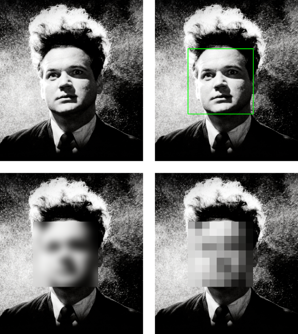
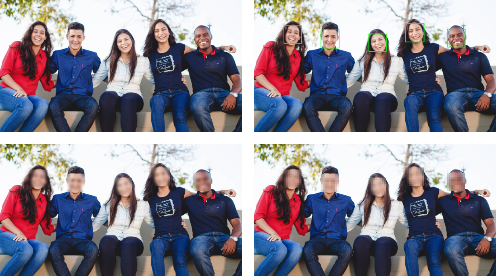
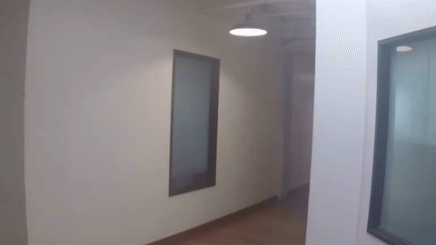

## Erasedhead

Objectif : implémenter un floutage automatique de visage, en utilisant OpenCV et les cascades de Haar pour la détection faciale. Elle doit être possible sur une photo individuelle ou une photo de groupe, en noir et blanc ou en couleurs, mais aussi depuis une vidéo existante ou depuis la webcam, en direct. Pour anonymiser les visages, l'effet appliqué dans un premier temps a été le flou gaussien, puis dans un second temps un effet pixelisé (légèrement plus complexe, mais plus efficace).

## Example n°1
*Affiche du film Eraserhead de David Lynch (1977)*

## Example n°2
*[(Source)](https://unsplash.com/fr/photos/groupe-de-personnes-assises-sur-un-banc-pres-darbres-en-train-de-duper-pendant-la-journee-Q_Sei-TqSlc)*

## Example n°3 (vidéo)
*[(Source)](https://github.com/intel-iot-devkit/sample-videos?tab=readme-ov-file)*

## Améliorations possibles

Dans cette version, la détection faciale a été réalisée avec la méthode des cascades de Haar. Même si elle a facilité l'implémentation, sa performance n'est pas toujours optimale, avec des limites potentielles lorsque la personne porte des lunettes, lors d'un mouvement trop vif ou encore lorsque son visage est incliné (ce qui semblerait être la limite principale de cette méthode). Selon les applications d'un programme comme celui-ci, il suffit d'une frame où l'anonymisation n'est pas appliquée pour qu'elle perde tout son intérêt. La méthode employée n'étant pas la plus avancée, elle pourrait donc être améliorée. Par exemple, il serait possible d'entraîner un modèle de Deep Learning, qui serait beaucoup plus performant et robuste. De plus, pour faciliter la détection entre deux frames et éviter qu'elle vacille (avec un mouvement trop vif ou une inclinaison du visage par exemple), nous pourrions appliquer l'object tracking au visage détecté pour le suivre tout au long d'une vidéo.
